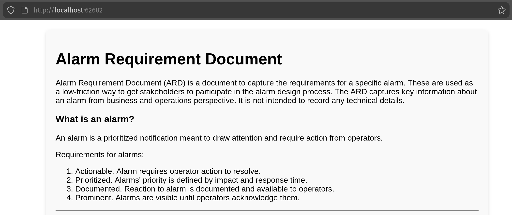
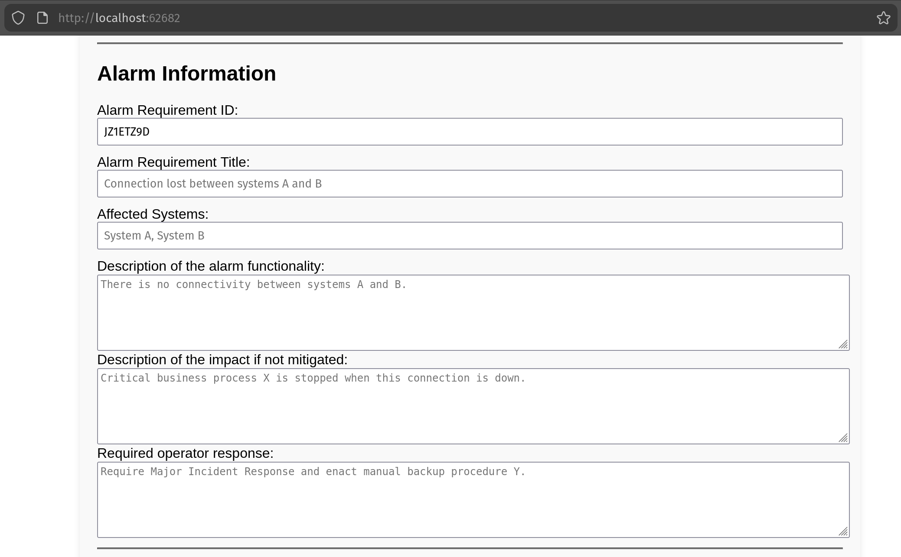
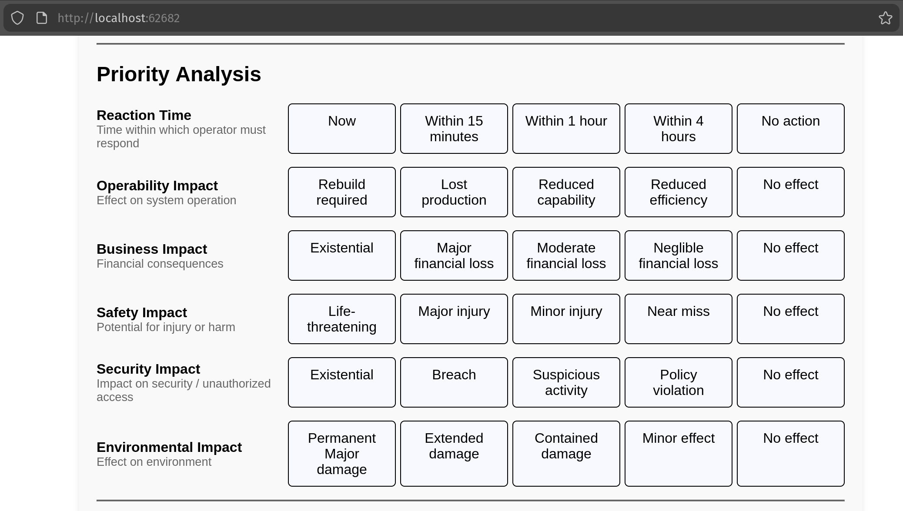
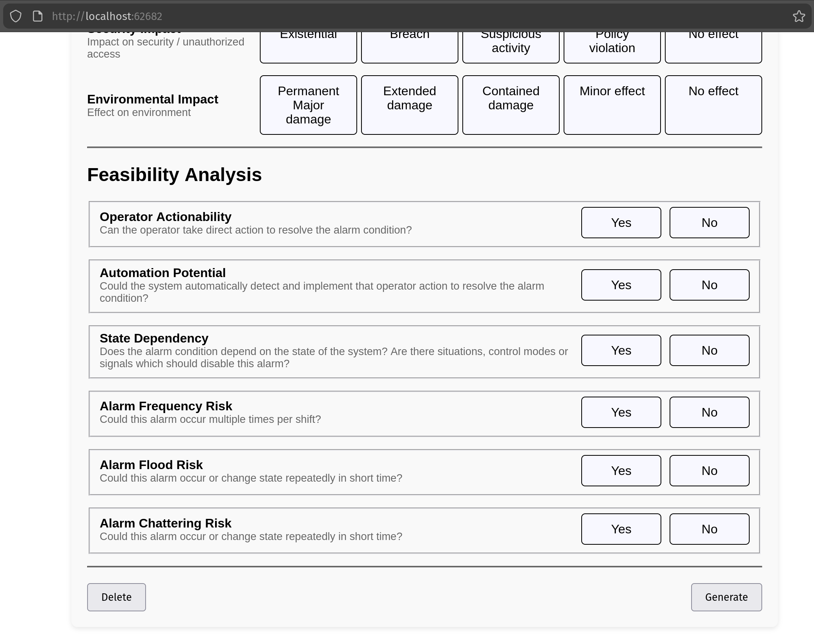

# Alarm Requirement Document generator
Having something is infinitely better than having nothing.

Often having nothing is the situation when it comes to defining industrial automation alarms, or even requirements that are used to define those alarms.
This tooling is supposed to ease that pain, by giving an simple opionated way to define requirements for alarms.
First I though about using Excel for this, but finally decided on python.

## Usage (planned)

Start the program and head to http://localhost:62682.

Software opens with input form for defining new Alarm Requirement Document (ARD). Any input is stored in browsers localstorage, so that work is not too easy to lose.

Fill the form and press "generate", or "delete and start again" for clean form. The program forwards you to a results page which has proper formatting for printing to A4 size. This allows you to easily save the results.

### Why?

The overaching theme here is to have a low-friction way to get stakeholders (operators, system owners) participating in the alarm systems. Way too often everything is defined as an alarm, making them more distracting than useful. It is quite normal to see active alarms lists full of unacknowledged alarms in the control rooms.

One of the many reasons for this is that systems owners do not know about the processes in order to properly define alarms. While the operators are used to just trying to make anything they're given work for their daily operations.

If we can engage the operators (users) easily to define some alarms, then we can kickstart something that could finally evolve into IEC 62682 Alarm Management Process. That's the dream.

And by the way, these alarm issues are not the norm only for industrial use cases. IT systems suffer from the same things.

## What is an alarm anyway?

Alarm has couple things that are required for it to be useful. If these do not apply, you have something else than alarm. There of course can be a need for logging, events or some kind of alerts. But those are not alarms, they should not distract, should not use alarm colors and should not appear on any active alarm lists.

Alarms on the other hand should be state machines with no historicality. Alarms are shown to the operator in relevant parts of the UI and in any active alarms lists. If you need history of what alarms have happened and when operators reacted to those, generate events based on the state changes in alarms.

Requirements to be classified as an alarm:
1. When alarm is active, some operator action is required as a response to it.
2. That required action is documented and available to the operators.
3. Priority of an alarm is defined by multiple factors, one of which is the reaction time required from operators.
4. Alarms require operator acknowledgement. They do not disappear without acknowledgement. This is to make sure that operators can see what they are required to do.

When implemented properly, alarms are basically prioritized work lists for operators. Proper alarm system is the most important tool for operators in control rooms, but often they actually are the largest blocker to operators work.

## Screenshots

### Input Form

### Generated Alarm Requirement Document